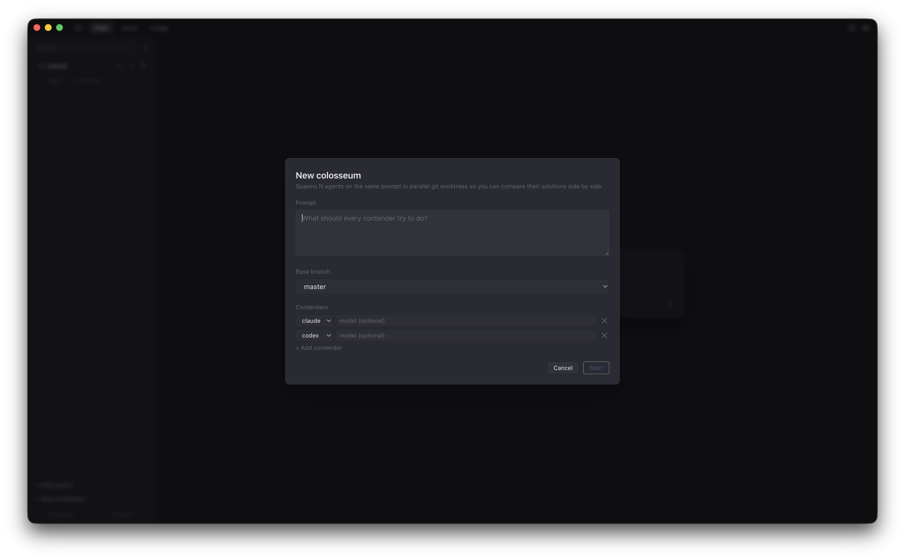

<p align="center">
  
</p>

<h1 align="center">Overcli</h1>

<p align="center">
  <sub><code>over·CLI</code> — a GUI that sits <em>over</em> your CLIs. Yes, that's the name.</sub>
</p>

<p align="center">
  <strong>Four coding agents. One honest window.</strong><br />
  A cross-platform desktop app that wraps <code>claude</code>, <code>codex</code>, <code>gemini</code>, and <code>ollama</code> in a single GUI —
  conversations, diffs, git worktrees, and usage stats in the same place.
</p>

<p align="center">
  
  
  
  
  
</p>

<p align="center">
  <a href="#download">Download</a> ·
  <a href="#features">Features</a> ·
  <a href="#development">Dev</a> ·
  <a href="#contributing">Contributing</a> ·
  <a href="#a-fatherson-project">About</a>
</p>

---

> Overcli is a fan-built desktop client. It is **not** affiliated with Anthropic, OpenAI, or Google. It runs on top of the official `claude`, `codex`, and `gemini` CLIs and the open-source `ollama` runtime — whatever auth those already have is the auth Overcli uses. No API keys required.

## Screenshots

<p align="center">
  <em>Chat — one window for every coding agent you already use.</em><br />
  
</p>

<p align="center">
  <em>Colosseum — same prompt, every backend in parallel.</em><br />
  
</p>

<p align="center">
  <em>Local — a real UI for your Ollama install.</em><br />
  
</p>

> Screenshots live in `docs/screenshots/`. If you're reading this and the images are missing, drop captures at those paths and they'll light up.

## Features

| # | Feature | What it does |
|---|---|---|
| 01 | **Multi-backend chat** | Claude, Codex, Gemini, and Ollama — four stream parsers, one consistent UI. Markdown, syntax highlight, streaming tokens. Cloud or local, same window. |
| 02 | **No API keys required** | Sits on top of the CLIs you already use. Whatever auth `claude` / `codex` / `gemini` / `ollama` have is the auth you get. No new billing. No new secrets on disk. |
| 03 | **Workspaces** | Projects of projects. Group related repos and talk to them as one — the agent edits across repos, runs every test suite, shows one review. Polyrepo that feels like monorepo. |
| 04 | **Silent agents** | Long-running background agents: a *doc-writer* that keeps `/docs` in sync, a *PR-reviewer* that comments the moment a PR opens. No Slack pings, no dashboards. |
| 05 | **Rebound reviews** | After every turn, fire a second agent — on a different backend if you like — to review what just landed. Thinking blocks visible, round counter included. Collaboration mode loops until the reviewer is quiet. |
| 06 | **Tool cards** | File edits render as diffs. Bash lives in a terminal block. Reads, writes, todos each get their own card — so you can actually see what the agent did. |
| 07 | **Permission & approval** | Claude permission prompts and Codex approval cards (exec + apply_patch) are proper UI elements, not modal interruptions. |
| 08 | **History from disk** | Reads prior transcripts straight out of `~/.claude/projects`, `~/.codex/sessions`, and `~/.gemini/tmp`. Nothing re-invented. |
| 09 | **File editor** | Syntax highlighting, line-range highlighting, HTML & Markdown preview tabs. No context-switch to VS Code. |
| 10 | **Extensions browser** | Unified pane for slash commands, sub-agents, skills, plugins, MCP servers — across every backend. Rescan on demand. |
| 11 | **Keyboard first** | <kbd>⌘P</kbd> file finder, <kbd>⌘\</kbd> sidebar, <kbd>⌘,</kbd> settings, <kbd>⌘K</kbd> quick switcher. |
| 12 | **Agent worktrees** | Create, update, rebase, merge, push, or remove a git worktree from inside the conversation. Agents work in isolation; you merge when you like what you read. |
| 13 | **Changes bar** | Live `+/−` rollup above the composer counting everything touched this turn. Click to expand, click a file to jump to it, click commit. |
| 14 | **Local model dashboard** | A real UI for Ollama: catalog, filter by maker or country, pull & delete with one click, live server logs, GPU readout. |
| 15 | **Usage dashboard** | Rolling 5h / 24h / 7d stats, broken down by backend, model, and project. |
| 16 | **Smart downgrades** | Near a rate or cost cap, Overcli can step down automatically — `opus` → `sonnet`, cloud → local Ollama — so the next turn still ships. Off by default. |
| 17 | **Health badges** | Per-backend status pills: *ready*, *unauthenticated*, *missing*, *error*. Know what's broken before you try to use it. |
| 18 | **Colosseum** | Fire one prompt at every backend in parallel. Compare the diffs side by side. Keep the winner, discard the rest. |

## Download

Builds are produced by the release workflow and land on the [Releases page](https://github.com/lionelfarr/overcli/releases).

| Platform | Artifact |
|---|---|
| **macOS** · arm64 + x64 | `.dmg` · `.zip` |
| **Windows** · x64 + arm64 | NSIS installer |
| **Linux** · x64 + arm64 | `.AppImage` · `.deb` |

> ⚠️ Builds are **unsigned**. macOS shows *"unidentified developer"* on first open — right-click the app → **Open**. Do it once, it sticks. Prefer to build it yourself? See [Build & package](#build--package) below.

## Requirements

Overcli is a thin GUI over CLIs you install separately. Install whichever ones you want to use:

| Backend | CLI | Install |
|---|---|---|
| Claude | `claude` | `npm i -g @anthropic-ai/claude-cli` |
| Codex | `codex` | `npm i -g @openai/codex` |
| Gemini | `gemini` | `npm i -g @google/gemini-cli` |
| Ollama | `ollama` | [ollama.com](https://ollama.com) |

You don't need all four — Overcli's health badges will show you which ones it can reach, and the app works fine with just one installed.

## Development

```bash
git clone https://github.com/lionelfarr/overcli
cd overcli
npm install
npm run dev
```

`dev` runs three watchers concurrently:

- **vite** — renderer dev server at http://localhost:5173
- **tsc** — main-process incremental compile into `dist/main/`
- **electron** — waits for both, then launches Electron pointed at the Vite dev URL

### Scripts

| Command | What it does |
|---|---|
| `npm run dev` | Full development loop (vite + tsc + electron). |
| `npm run build` | Compile main process + build renderer bundle. |
| `npm start` | Build and launch the packaged output unpackaged. |
| `npm test` | Run the Vitest suite. |
| `npm run test:watch` | Vitest in watch mode. |
| `npm run test:coverage` | Vitest with v8 coverage. |

## Build & package

Unpackaged smoke test (just `electron .` against the compiled output):

```bash
npm run build
npm start
```

Distributable installers:

```bash
npm run dist        # every target the host supports
npm run dist:mac    # macOS .dmg + .zip (arm64 + x64)
npm run dist:win    # Windows NSIS (x64 + arm64)
npm run dist:linux  # AppImage + .deb (x64 + arm64)
```

Output lands in `release/`:

- `release/mac-arm64/Overcli.app` — double-clickable .app
- `release/Overcli-<version>.dmg` — drag-to-Applications installer
- `release/Overcli-<version>-mac.zip` — zipped .app for auto-updater flows

### Signing (optional)

Builds are unsigned by default. To produce a signed + notarized macOS build, set your Apple Developer ID credentials:

```bash
export CSC_LINK=/path/to/developer-id.p12
export CSC_KEY_PASSWORD=...
export APPLE_ID=...
export APPLE_APP_SPECIFIC_PASSWORD=...
npm run dist:mac
```

See [electron-builder's code-signing docs](https://www.electron.build/code-signing) for details.

## Architecture

```
src/
  shared/        types shared by main + renderer (the IPC wire contract)
  main/          Electron main process
    index.ts       app lifecycle, IPC handlers, window
    runner.ts      subprocess manager per conversation
    parsers/       claude / codex / gemini stream-event parsers
    history.ts     load prior transcripts from disk
    store.ts       on-disk persistence (single overcli.json)
    git.ts         worktree ops for agent conversations
    stats.ts       usage aggregation
    health.ts      backend ready / unauth / missing probes
    workspace.ts   workspace model (projects-of-projects)
    reviewer.ts    rebound-review orchestration
    ollama.ts      Ollama model catalog + server control
  preload/       contextBridge exposing `window.overcli`
  renderer/      React app
    App.tsx, components/, store.ts (Zustand), theme.ts, hooks.ts
```

**Tech** — Electron 41, React 18, TypeScript, Vite, Tailwind, Zustand.

### How a turn flows

1. User types in the composer; the renderer IPCs the message to main.
2. `runner.ts` spawns (or reuses) the appropriate CLI subprocess.
3. The CLI's stream events hit `parsers/<backend>.ts`, which normalises them into a backend-agnostic `TurnEvent` stream.
4. Those events flow back to the renderer and become tool cards, message bubbles, approval cards, and diffs in `ChatView.tsx`.
5. On completion, `stats.ts` records the turn; `reviewer.ts` optionally kicks off a rebound review on a second backend.

## Contributing

Issues, bug reports, and PRs welcome — please open an issue first for anything non-trivial so we can talk about the shape of it. The app's built to be *explainable*, so expect review comments asking "why this, not that."

- [Open an issue](https://github.com/lionelfarr/overcli/issues/new)
- Check existing issues and discussions before filing duplicates
- Run `npm test` before submitting a PR
- Follow the existing code style (TypeScript strict, no semicolons-optional drama, Prettier defaults via editor)

## Not included (by choice)

- **Time Travel** — forking a conversation at a specific turn
- **Replay bundles** — exporting a conversation as a self-contained replay

Anything else missing that you'd expect? It's a bug — please file it.

## A father–son project

Overcli is a collaboration between **[Lionel Farr](https://github.com/lionelfarr)** and his son **[Owen Farr](https://github.com/owenlfarr)**. It started as a way to spend time building something real together — Owen learning how a production app actually comes together (IPC, state, streaming, diffs, packaging), Lionel getting to teach by doing instead of explaining in the abstract. Every feature above is an excuse for a conversation about *why* it's designed the way it is.

> If you're reading the code and wondering why some decisions look the way they do — it's because they were chosen to be *explainable*, not just clever.

## License

[MIT](LICENSE)
