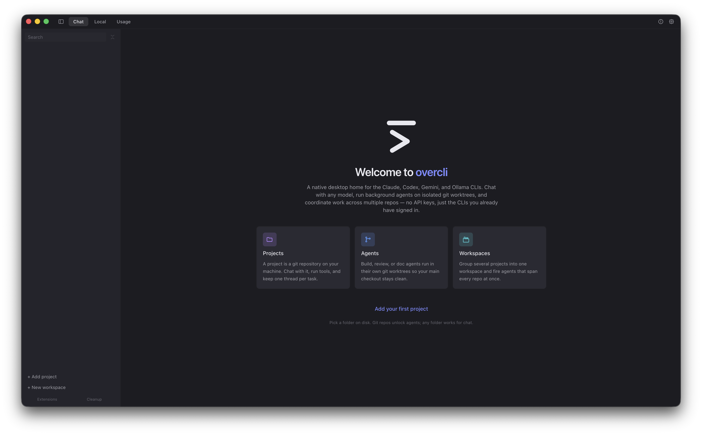
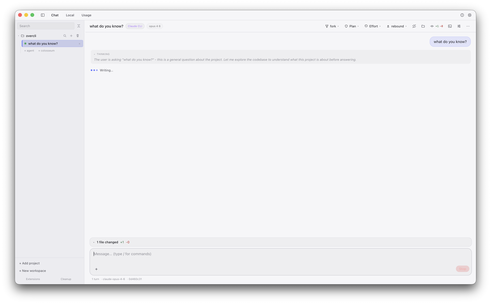
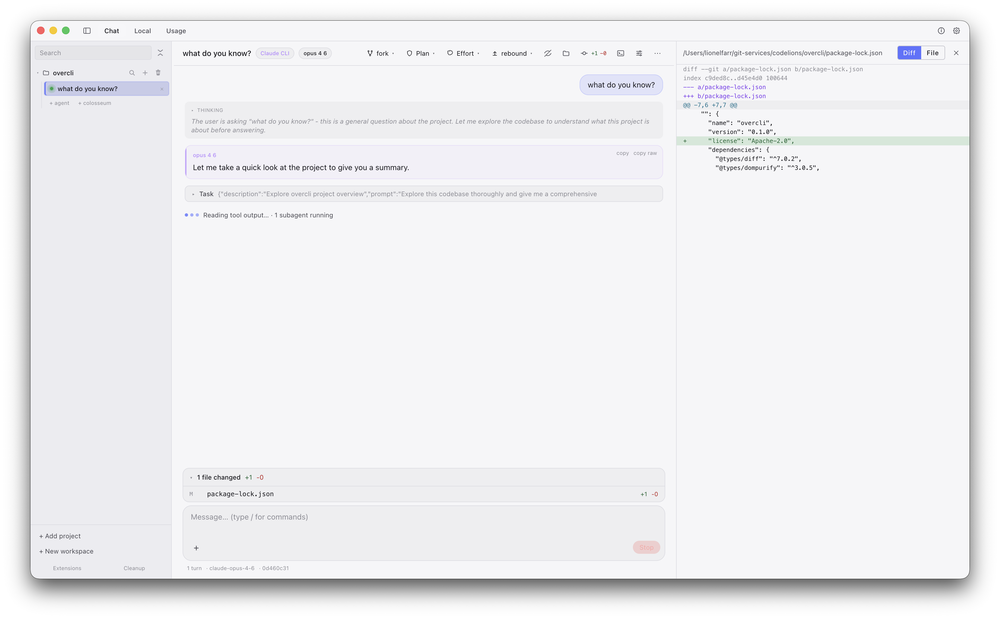
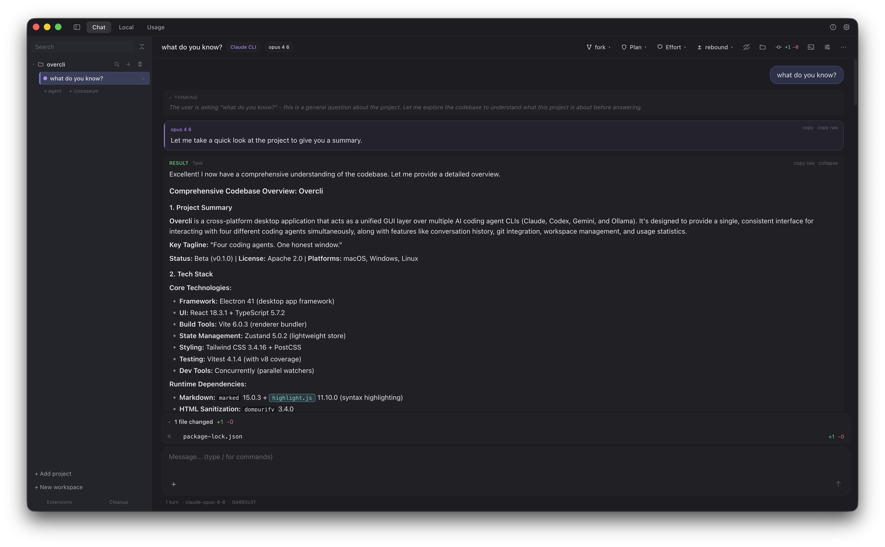

<p align="center">
  
</p>

<h1 align="center">Overcli</h1>

<p align="center">
  <strong>The desktop command center for coding-agent CLIs.</strong>
</p>

<p align="center">
  One UI for Claude, Codex, Gemini, and Ollama: chat, diffs, worktrees, and review loops in the same window.
</p>

<p align="center">
  <a href="https://github.com/lionelfarr/overcli/actions/workflows/ci.yml"></a>
  
  
  
  
  
</p>

<p align="center">
  <a href="#why-overcli">Why Overcli</a> ·
  <a href="#screenshots">Screenshots</a> ·
  <a href="#features">Features</a> ·
  <a href="#quick-start">Quick Start</a> ·
  <a href="#contributing">Contributing</a>
</p>

---

> Overcli is a fan-built desktop client and is not affiliated with Anthropic, OpenAI, or Google.

Overcli runs on top of the official `claude`, `codex`, and `gemini` CLIs plus the open-source `ollama` runtime. It uses your existing CLI authentication and local environment.

## Why Overcli

Coding-agent workflows are powerful, but usually scattered across multiple terminals and tools. Overcli brings them together so you can:

- Compare backend output side by side
- Inspect edits as real diffs before commit
- Run agents in isolated git worktrees
- Keep review loops in the same conversation

## Screenshots

<p align="center">
  <em>Welcome: pick a project, backend, or workspace and start immediately.</em><br />
  
</p>

<p align="center">
  <em>Chat with streaming responses and structured tool activity.</em><br />
  
</p>

<p align="center">
  <em>Inline side-by-side diffs for file edits.</em><br />
  
</p>

<p align="center">
  <em>Dark theme transcript rendering.</em><br />
  
</p>

<p align="center">
  <em>Colosseum: one prompt to all backends in parallel.</em><br />
  
</p>

## Features

- Multi-backend chat for Claude, Codex, Gemini, and Ollama
- Consistent streaming UI with markdown, syntax highlighting, tool cards, and diffs
- Workspace model for multi-repo development
- Git worktree creation, update, merge, push, and cleanup from the app
- Rebound reviewer loops with optional cross-backend validation
- Permissions and approvals surfaced as first-class UI cards
- Backend health badges (`ready`, `unauthenticated`, `missing`, `error`)
- Local Ollama model management and usage tracking

## Download

Release artifacts are published on the [GitHub Releases page](https://github.com/lionelfarr/overcli/releases).

| Platform | Artifacts |
|---|---|
| macOS (arm64, x64) | `.dmg`, `.zip` |
| Windows (x64, arm64) | NSIS installer |
| Linux (x64, arm64) | `.AppImage`, `.deb` |

Unsigned builds may trigger OS trust prompts on first launch.

## Quick Start

### 1. Install the backends you want to use

| Backend | CLI | Install |
|---|---|---|
| Claude | `claude` | `npm i -g @anthropic-ai/claude-code` |
| Codex | `codex` | `npm i -g @openai/codex` |
| Gemini | `gemini` | `npm i -g @google/gemini-cli` |
| Ollama | `ollama` | [ollama.com](https://ollama.com) |

### 2. Run Overcli in development

```bash
git clone https://github.com/lionelfarr/overcli
cd overcli
npm install
npm run dev
```

### 3. Build release artifacts

```bash
npm run dist
npm run dist:mac
npm run dist:win
npm run dist:linux
```

Output is written to `release/`.

## Development Scripts

| Command | Description |
|---|---|
| `npm run dev` | Vite + TypeScript watch + Electron |
| `npm run build` | Build main and renderer bundles |
| `npm start` | Build and launch Electron |
| `npm test` | Run tests once with Vitest |
| `npm run test:watch` | Run Vitest in watch mode |
| `npm run test:coverage` | Run Vitest with coverage |

## Architecture

```text
src/
  shared/      Shared types and IPC contracts
  main/        Electron main process, backend adapters, parsers, git/workspace/stats
  preload/     Context bridge API (window.overcli)
  renderer/    React app (views, components, state)
```

Tech stack: Electron 41, React 18, TypeScript, Vite, Tailwind, Zustand.

## Community

Contributions are welcome, including code, docs, bug reports, and UX feedback.

- Open issues: [github.com/lionelfarr/overcli/issues](https://github.com/lionelfarr/overcli/issues)
- Propose fixes and features through pull requests
- Improve onboarding and reproducible bug reports

## Contributing

- Read [CONTRIBUTING.md](CONTRIBUTING.md)
- Review [CODE_OF_CONDUCT.md](CODE_OF_CONDUCT.md)
- For security reports, see [SECURITY.md](SECURITY.md)

## License

Licensed under the [Apache License, Version 2.0](LICENSE). See [NOTICE](NOTICE) for attributions.

Copyright © 2026 Lionel Farr and Owen Farr.
